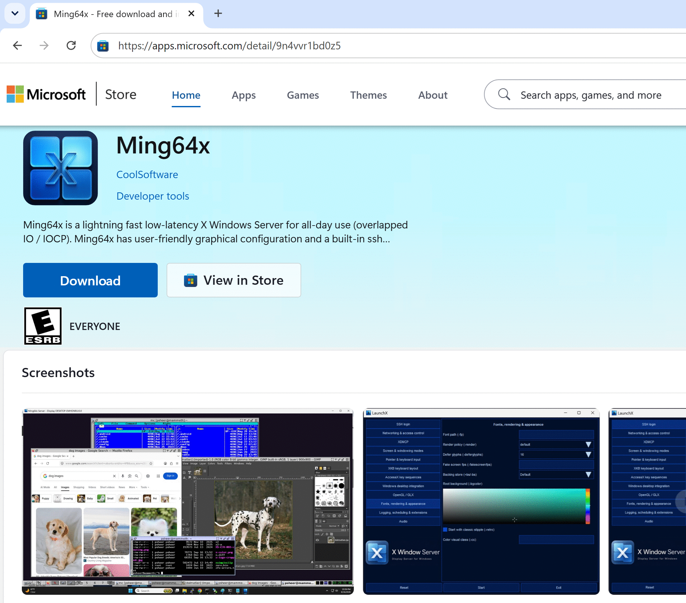

# Ming64x — Low latency X11 server for Windows

➡️ With full audio support

➡️ With built-in ssh terminal

➡️ With image copy-paste between Windows/Linux

➡️ Uses Windows overlapped-io and IO completion ports for speed

## DOWNLOAD
Ming64x can be downloaded in the [Microsoft Store](https://apps.microsoft.com/detail/9N4VVR1BD0Z5) 

